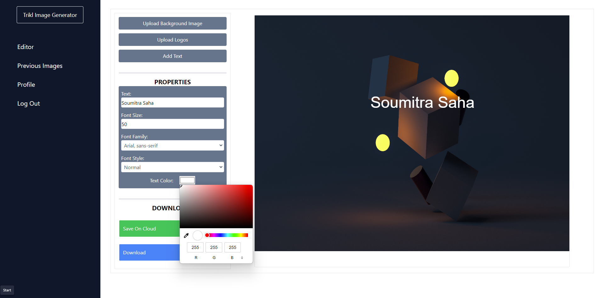
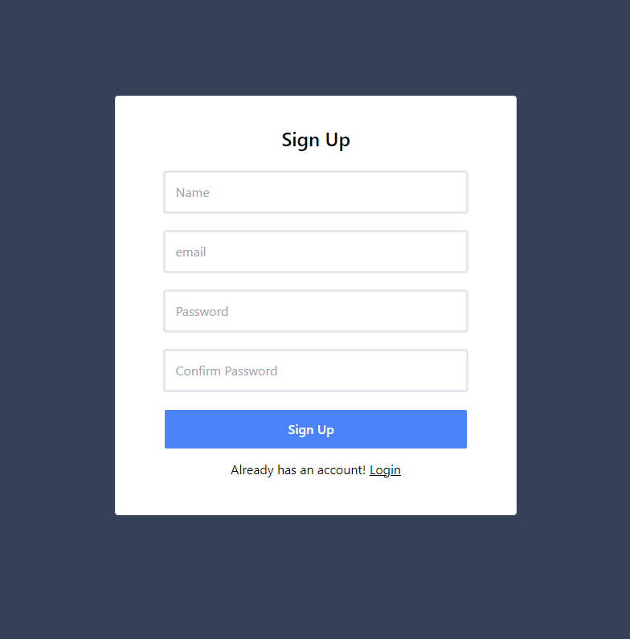

# Image Generator Function

### **Project Overview:**

I have completed a web application that enables users to upload an image, add multiple logos or images on top of it, overlay text, and offers an option to download the final edited image. The project is built using the MERN stack.

[Deployment Link](https://image-generator-frontend-one.vercel.app/): https://image-generator-frontend-one.vercel.app/

API Collection => In API Collection Folder

### **Requirements:**

### Backend (Node.js and Express.js):

1. Set up a Node.js server using Express.js to handle the backend functionality.
2. Established a MongoDB database to store uploaded and edited images.
3. Created RESTful API endpoints for:
    - Uploading images.
    - Saving and retrieving edited images.

### Frontend (React.js):

1. Developed a React.js frontend that allows users to:
    - Upload/use the URL of an image file.
    - Add multiple logos or images on top of the uploaded image.
    - Add multiple overlay text with customizable style, font size, colour, and position.
    - Preview the edited image in real time.
    - Download the final edited image.
2. Utilized the canvas library **`react-konva`** for handling the canvas functionality, which provides a convenient way to manipulate images and text on a canvas within React.
3. Ensured the user interface is intuitive and user-friendly.

### **Bonus Features (Optional):**

- Allow users to authenticate and save their editing sessions to return to them later.

### **Technology Stack:**

- Backend: Node.js, Express.js, MongoDB, Mongoose
- Frontend: React.js, react-konva (for canvas functionality), React Router (for routing)
- Styling: CSS or a CSS framework like Tailwind

### **Setup Guide:**

Follow these steps to set up and run the Image Generator Function on your local machine:

#### Backend:

1. Navigate to the `server` directory.
2. Install the required dependencies using `npm install`.
3. Copy `.env.sample` to `.env` file.

```
cd server
cp .env.sample .env
```

1. Start the server with `npm run dev`.
2. The backend server should now be running on `http://localhost:4000`.

#### Frontend:

1. Navigate to the `frontend` directory.
2. Install the required dependencies using `npm install`.
3. Start the frontend application with `npm start`.
4. The application should now be running on `http://localhost:3000`.

## Screen Shorts






# Additional Features

## Authentication and Authorization

The application includes a robust authentication and authorization system to secure user data and functionalities. This is achieved through the following components:

- **Bcrypt:** Passwords are securely hashed using the Bcrypt hashing algorithm. This ensures that user passwords are stored securely in the database.
  
- **JSON Web Token (JWT):** JWTs are used to securely transmit information between the client and server. They are signed and can be optionally encrypted to provide an additional layer of security.

- **Refresh Token:** A refresh token mechanism is implemented to enhance the security of user authentication. This allows for the issuance of short-lived access tokens and helps protect against unauthorized access.

- **Session Time:** User sessions have a defined expiration time, providing an additional layer of security against potential unauthorized access.


## Profile Page

A user-friendly profile page is integrated into the application. This page allows users to view and manage their account information, including:

- **Profile Picture:** Users can upload and change their profile picture.

- **Personal Information:** Users can view and update their personal information such as name, email, and any other relevant details.

## Get User Info API

The application provides an API endpoint that allows authorized users to retrieve their own user information. This can be useful for various functionalities, including customization and personalization.

## Get Previous Images API and Pages

Users have the ability to access their previously edited images through both an API endpoint and dedicated pages within the application. This feature enables users to easily review and download their previously created content.

